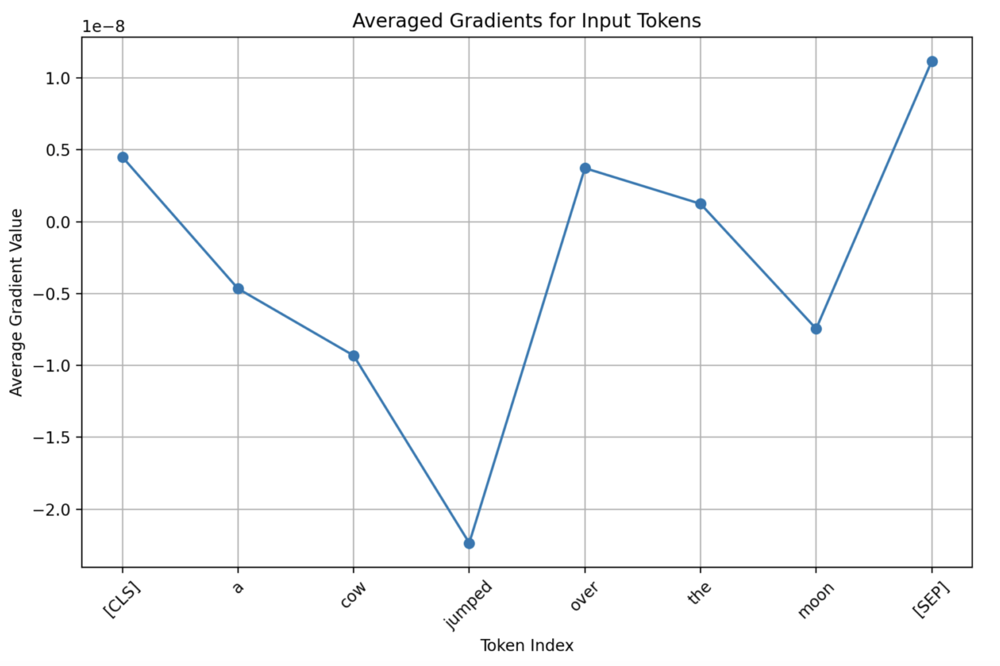
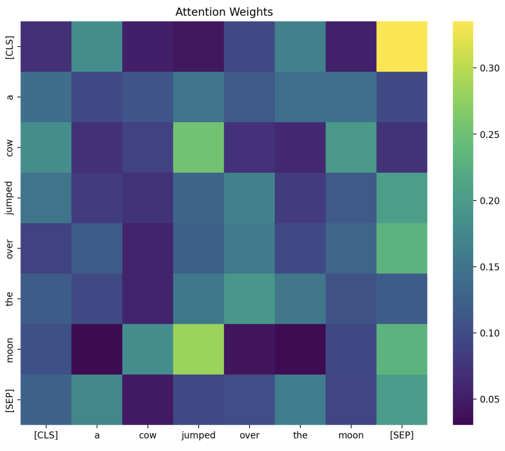
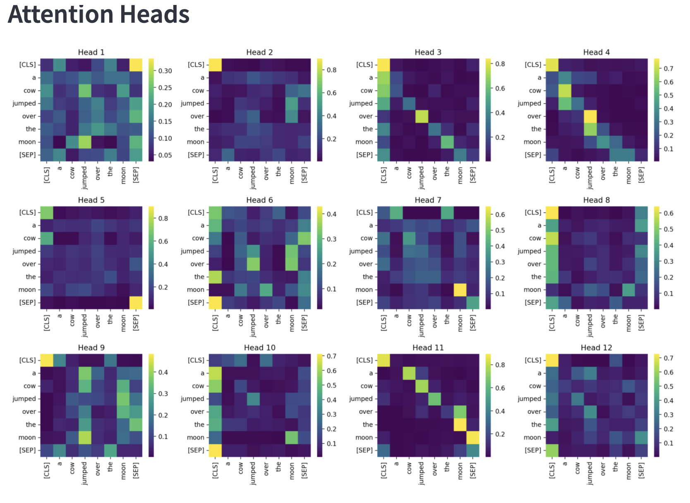
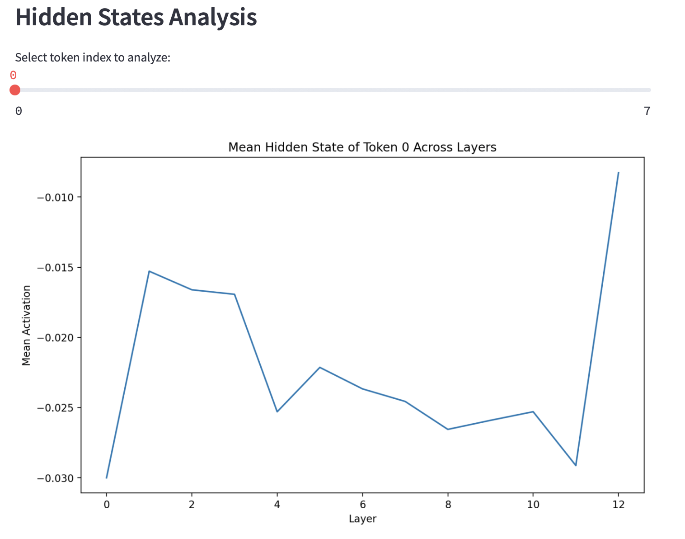
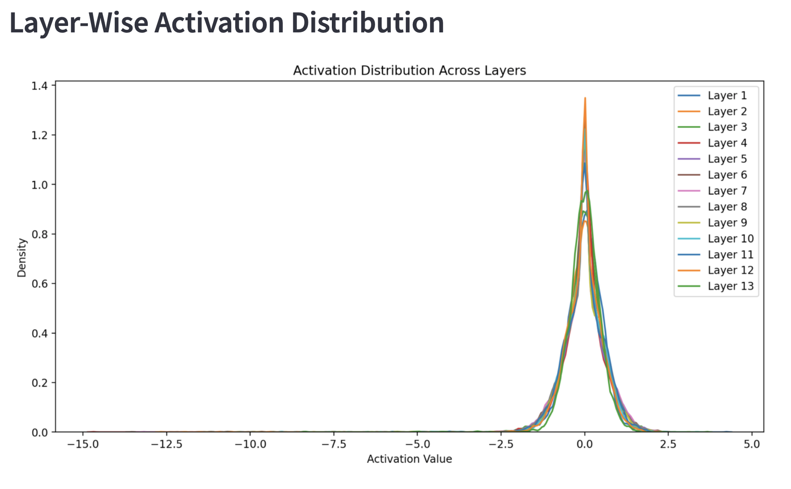

# Transformer Model Visualization App

This application visualizes the internal workings of transformer-based models like **BERT**, **DistilBERT**, **RoBERTa**, and **ALBERT**. It provides insights into gradients, attention mechanisms, hidden states, and activation distributions for a given input text.

## Features
- **Model Selection**: Choose from popular transformer models.
- **Gradient Analysis**: Visualize token-level gradients to understand model sensitivity.
- **Attention Heatmap**: Explore attention weights across tokens.
- **Attention Heads**: Compare attention patterns across multiple heads.
- **Hidden States Analysis**: Examine hidden state activations across layers.
- **Activation Distribution**: Visualize the distribution of activations across layers.

## Functions

### Main Application (`app.py`)
- `get_model(model_name)`: Loads and caches the selected transformer model
- `main()`: Main application logic and UI components

### Utilities (`app_utils.py`)
- `load_model(model_name)`: Loads the specified transformer model and tokenizer
- `process_text(text, model, tokenizer)`: Processes input text through the model
- `plot_gradients(embeddings, inputs, tokenizer)`: Generates gradient analysis plots
- `plot_attention_heatmap(outputs, inputs, tokenizer)`: Creates attention heatmap visualization
- `plot_attention_heads(outputs, inputs, tokenizer)`: Visualizes multiple attention heads
- `plot_hidden_states(outputs, token_index)`: Analyzes hidden states for specific tokens
- `plot_activation_distribution(outputs)`: Shows activation distribution across layers

## Prerequisites
- Python 3.8 or higher
- Libraries listed in `requirements.txt`

## Installation

1. Clone the repository:
    ```bash
    git clone https://github.com/dhamu2github/generativeai.git
    cd transformer
    ```

2. Create a virtual environment:
    ```bash
    python -m venv venv
    source venv/bin/activate   # On Windows: venv\Scripts\activate
    ```

3. Install dependencies:
    ```bash
    pip install -r requirements.txt
    ```

## Usage

1. Run the Streamlit app:
    ```bash
    streamlit run app.py
    ```

2. Open your browser and navigate to the provided local URL (e.g., `http://localhost:8501`).

3. Select a transformer model from the dropdown menu, input text, and click **Analyze** to generate visualizations.

## File Overview
```
├── app.py                # Main Streamlit application
├── app_utils.py          # Utility functions for model operations and plotting
├── requirements.txt      # Project dependencies
└── readme.md             # This file
```

## Visualization Components

### Gradient Analysis
- Displays the averaged gradients for each input token
- Helps understand which tokens contribute most to the model's predictions

### Attention Heatmap
- Shows the attention weights between tokens
- Visualizes how different words relate to each other in the model's attention mechanism

### Attention Heads
- Provides detailed views of individual attention heads
- Displays 12 different attention patterns across heads

### Hidden States Analysis
- Allows analysis of hidden state values for specific tokens
- Includes a slider to select different token positions

### Activation Distribution
- Shows the distribution of activation values across different layers
- Helps understand the model's internal representations

## Visualization Examples
By default, the app loads with the input text: "A cow jumped over the moon." The visualizations below are generated using the model "bert-base-uncased".

1. **Gradient Analysis** [Click here to understand the graph](https://docs.google.com/document/d/1WRKv4-ptH4km6GeuzTcl4xNya374hFOyqfSg32jw1P4/edit?tab=t.0#heading=h.jpk29mb4p1ia)
   

2. **Attention Heatmap** [Click here to understand the heatmap](https://docs.google.com/document/d/1F2BpcgN6SaX-4ubiXgnZBwJi6gySDsFfm8kSyKTuRzs/edit?tab=t.0#heading=h.3lsu0j1dvuzq)
   

3. **Attention Heads Analysis** [Click here to understand the attention heads](https://docs.google.com/document/d/1TIPY61Qgy5HOHSQTVf6y1ot6HlkKEf6PISxHA1LXndQ/edit?tab=t.0#heading=h.fnfy7hkbjx96)
   

4. **Mean Hidden State Analysis** [Click here to understand the hidden state](https://docs.google.com/document/d/1508lW6B0mRA8tMYeRRYz78yQr4T9vmplRi-YZqXMC7g/edit?tab=t.0#heading=h.amos3lakh255)
   

5. **Activation Distribution** [Click here to understand the activation distribution](https://docs.google.com/document/d/15equQqDm5FBNSagDnm2tMaP9JAQppvkgmEX1VZuLpSA/edit?tab=t.0#heading=h.i43zrfbupu72)
   

## Models Supported
- `bert-base-uncased`
- `distilbert-base-uncased`
- `roberta-base`
- `albert-base-v2`

## Customization
To add more models, update the `model_name` list in `app.py`:
```python
model_name = st.selectbox(
    "Choose a Transformer Model:",
    ["bert-base-uncased", "distilbert-base-uncased", "roberta-base", "albert-base-v2", "your-custom-model"]
)
  ```

## Acknowledgments
- I would like to extend my sincere appreciation to Mr. Asif Qamar of [Support Vecors Lab](https://supportvectors.io/) for his guidance in cultivating critical thinking skills in AI.
- My thought process was enhanced by [claude.ai](https://claude.ai/)
- Built with [Streamlit](https://streamlit.io/)
- Uses [Hugging Face Transformers](https://huggingface.co/transformers/)
- Visualization powered by [Matplotlib](https://matplotlib.org/) and [Seaborn](https://seaborn.pydata.org/)